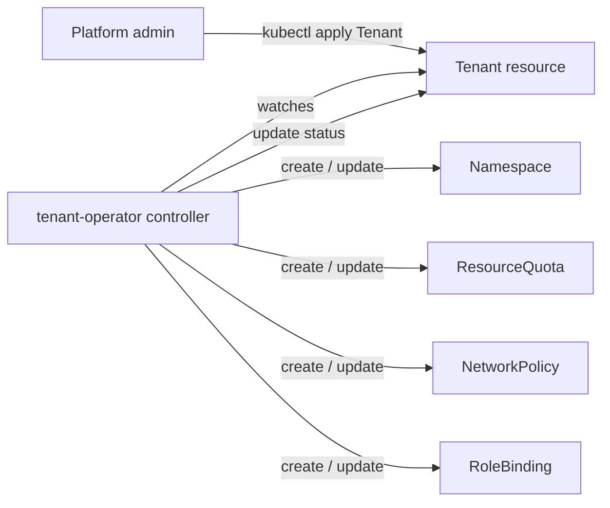

# tenant-operator

A Kubernetes operator, written in Go with [Kubebuilder](https://book.kubebuilder.io/), that
turns a single declarative `Tenant` resource into a fully provisioned, isolated tenant
workspace: a namespace with resource quotas, default-deny network isolation, and role-based
access for the tenant's owners.

It is a compact, production-shaped example of the **operator pattern** — a custom resource
plus a controller that continuously reconciles desired state into actual state.

> Status: learning and portfolio project. Built to demonstrate custom controllers, CRDs,
> RBAC, and NetworkPolicy in Go, running locally on minikube.

## What it does

Apply one `Tenant`:

```yaml
apiVersion: platform.example.io/v1alpha1
kind: Tenant
metadata:
  name: team-falcon
spec:
  displayName: "Team Falcon"
  owners:
    - "user:alice@example.io"
    - "group:team-falcon"
  resourceQuota:
    cpu: "8"
    memory: "16Gi"
    pods: 40
  networkIsolation: true
```

…and the operator continuously ensures the following exist and stay correct:

- A **Namespace** (`team-falcon`), labelled and owned by the Tenant.
- A **ResourceQuota** enforcing the requested cpu / memory / pods limits.
- A default-deny **NetworkPolicy** (plus allow-DNS) when `networkIsolation: true`.
- A **RoleBinding** granting the listed owners the built-in `edit` role inside their
  namespace, and nowhere else.
- A **status** reporting `Ready`, the namespace, and the observed generation.

Delete the `Tenant` and everything above is garbage-collected automatically via owner
references. Delete a managed resource by hand and the controller recreates it (self-healing).

## Architecture



## Quickstart (local, minikube)

Prerequisites: Go 1.24+, Docker Desktop, kubectl, [minikube](https://minikube.sigs.k8s.io/),
and the [Kubebuilder](https://book.kubebuilder.io/) CLI. On macOS:
`brew install kubebuilder minikube`.

```sh
# 1. Start a local cluster (Docker Desktop must be running)
minikube start --driver=docker

# 2. Install the Tenant CRD into the cluster
make install

# 3. Run the operator locally against the cluster (this blocks while watching)
make run

# 4. In a second terminal, create a tenant and watch it provision
kubectl apply -f config/samples/platform_v1alpha1_tenant.yaml

kubectl get tenants
# NAME          NAMESPACE     READY
# team-falcon   team-falcon   True

kubectl get resourcequota,networkpolicy,rolebinding -n team-falcon
```

Try the two operator properties:

```sh
# Self-healing (level-triggered): delete a managed resource, watch it return
kubectl delete resourcequota tenant-quota -n team-falcon
kubectl get resourcequota -n team-falcon          # recreated within ~1s

# Cascade delete (owner references): remove the Tenant, namespace is garbage-collected
kubectl delete tenant team-falcon
kubectl get ns team-falcon                         # NotFound
```

## Documentation

| Doc | What it covers |
|---|---|
| [docs/PROJECT-GUIDE.md](docs/PROJECT-GUIDE.md) | Complete, beginner-friendly explanation of the whole project, with diagrams. Start here. |
| [docs/SETUP.md](docs/SETUP.md) | Step-by-step build guide (every command, phase by phase). |
| [docs/tenant-operator-README.md](docs/tenant-operator-README.md) | Conceptual overview and the Tenant API reference. |
| [docs/progress.md](docs/progress.md) | The chronological build log and design decisions. |

## The Tenant API

**GVK:** `platform.example.io` / `v1alpha1` / `Tenant`. **Scope:** Cluster.

| Spec field | Type | Default | Description |
|---|---|---|---|
| `displayName` | string | "" | Human-friendly name (stored; not yet consumed by the controller). |
| `owners` | list of string | required, min 1 | Users/groups granted `edit`. Use `user:` or `group:` prefixes. |
| `resourceQuota.cpu` | string | "4" | Total CPU limit for the namespace. |
| `resourceQuota.memory` | string | "8Gi" | Total memory limit for the namespace. |
| `resourceQuota.pods` | integer | 20 | Maximum pods in the namespace. |
| `networkIsolation` | boolean | true | Apply a default-deny NetworkPolicy plus allow-DNS. |

## Project layout

```
api/v1alpha1/tenant_types.go         # the Tenant API (hand-written)
internal/controller/tenant_controller.go  # the reconcile logic (hand-written)
config/                              # generated CRD, RBAC, manager, samples
cmd/main.go                          # operator entrypoint (sets up the manager)
docs/                                # project documentation
```

Only the two `.go` files above are hand-written; the CRD and RBAC YAML are generated from
their `// +kubebuilder:...` markers by `make manifests` / `make generate`.

## Deploy in-cluster (instead of running locally)

```sh
make docker-build docker-push IMG=<some-registry>/tenant-operator:tag
make deploy IMG=<some-registry>/tenant-operator:tag
```

## Uninstall / teardown

```sh
kubectl delete -f config/samples/platform_v1alpha1_tenant.yaml   # remove tenants
make uninstall                                                   # remove the CRD
make undeploy                                                    # if deployed in-cluster
minikube stop                                                    # free local resources
```

## Roadmap

Finalizers, admission webhooks (validation/defaulting), per-owner roles, LimitRange,
Prometheus metrics, and Helm packaging. See
[docs/PROJECT-GUIDE.md](docs/PROJECT-GUIDE.md#14-roadmap--next-steps) for details.

## License

Copyright 2026. Licensed under the Apache License, Version 2.0. See
<http://www.apache.org/licenses/LICENSE-2.0>.
