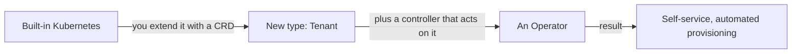
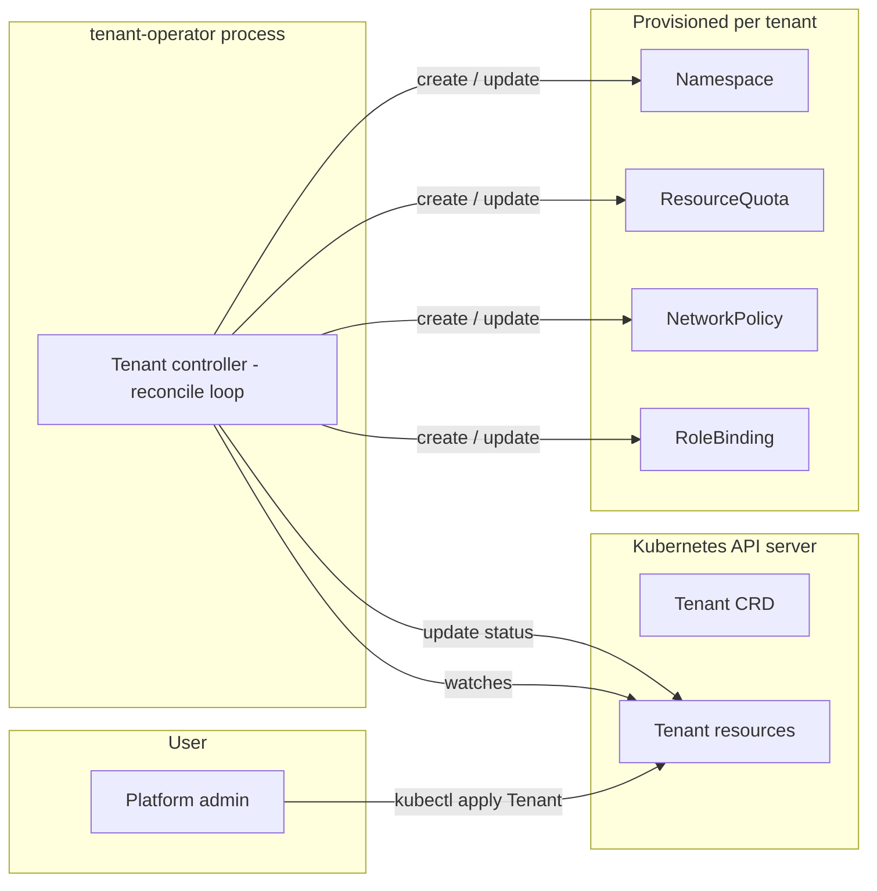
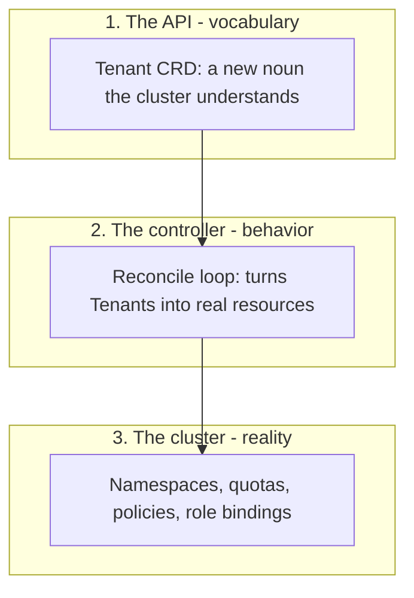
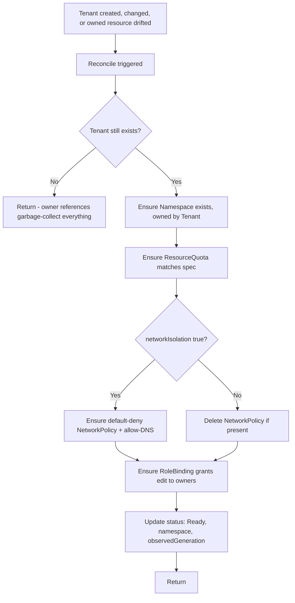
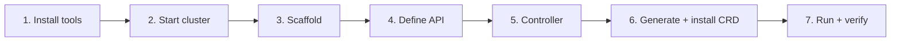
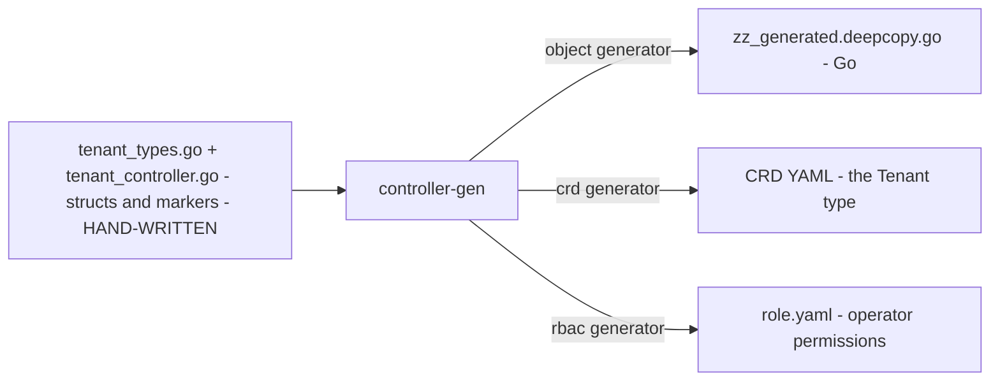
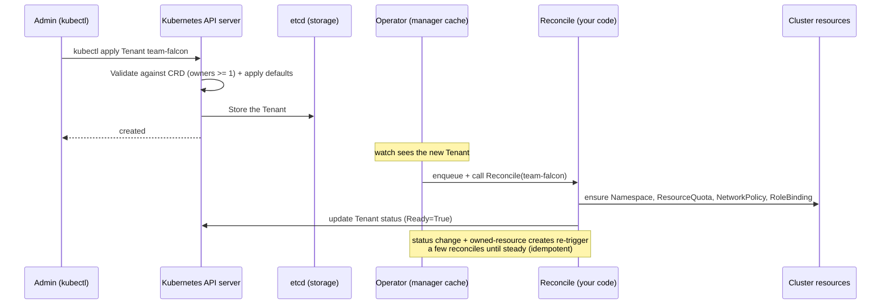
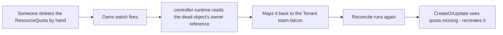
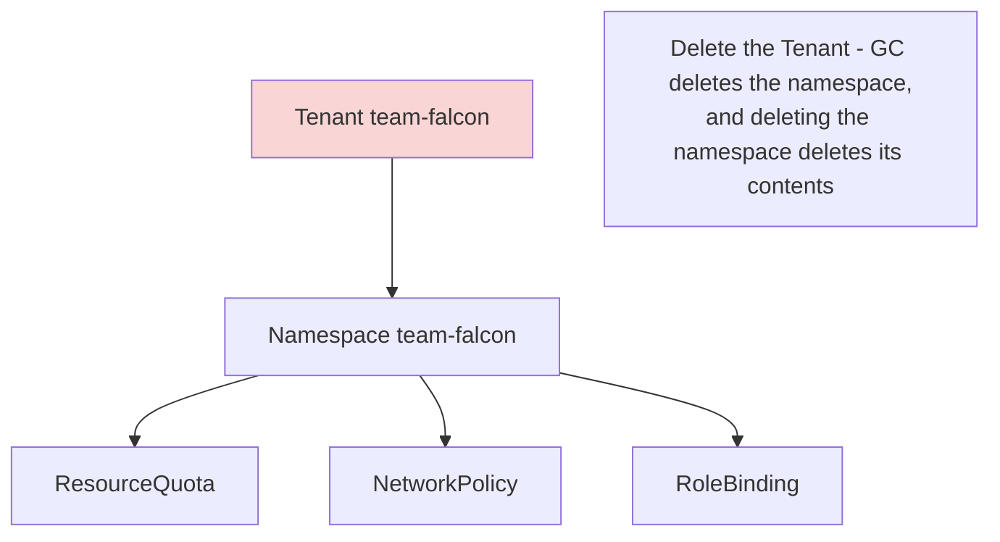

# tenant-operator — The Complete Project Guide

A detailed, beginner-friendly explanation of **what this project is, why it exists, how it
was built (phase by phase), and how every part works** — written so that someone with **no
prior Kubernetes or Go experience** can follow along. Diagrams included.

> Companion docs: [tenant-operator-README.md](tenant-operator-README.md) (concise overview),
> [SETUP.md](SETUP.md) (runnable step-by-step commands), [progress.md](progress.md) (the
> build log). This guide is the "explain everything" document that ties them together.

---

## Table of contents

- [tenant-operator — The Complete Project Guide](#tenant-operator--the-complete-project-guide)
  - [Table of contents](#table-of-contents)
  - [1. The 30-second summary](#1-the-30-second-summary)
  - [2. Background for absolute beginners](#2-background-for-absolute-beginners)
    - [Containers and Docker](#containers-and-docker)
    - [Kubernetes (K8s)](#kubernetes-k8s)
    - [The objects you'll meet here](#the-objects-youll-meet-here)
    - [Custom Resources and Operators — the key idea](#custom-resources-and-operators--the-key-idea)
  - [3. What problem this project solves](#3-what-problem-this-project-solves)
    - [Why we built it](#why-we-built-it)
  - [4. What our operator actually does](#4-what-our-operator-actually-does)
    - [The Tenant API at a glance](#the-tenant-api-at-a-glance)
  - [5. Architecture (with figures)](#5-architecture-with-figures)
    - [High-level view](#high-level-view)
    - [The three layers of the system](#the-three-layers-of-the-system)
  - [6. How the reconcile loop works](#6-how-the-reconcile-loop-works)
  - [7. The build, phase by phase](#7-the-build-phase-by-phase)
    - [Phase 1 — Install the toolchain](#phase-1--install-the-toolchain)
    - [Phase 2 — Start the cluster](#phase-2--start-the-cluster)
    - [Phase 3 — Scaffold the project](#phase-3--scaffold-the-project)
    - [Phase 4 — Define the Tenant API](#phase-4--define-the-tenant-api)
    - [Phase 5 — Implement the controller](#phase-5--implement-the-controller)
    - [Phase 6 — Generate manifests and install the CRD](#phase-6--generate-manifests-and-install-the-crd)
    - [Phase 7 — Run the operator and verify](#phase-7--run-the-operator-and-verify)
  - [8. How the code generation works](#8-how-the-code-generation-works)
  - [9. The lifecycle of a request (end to end)](#9-the-lifecycle-of-a-request-end-to-end)
  - [10. Self-healing and cascade delete](#10-self-healing-and-cascade-delete)
    - [Self-healing (level-triggered)](#self-healing-level-triggered)
    - [Cascade delete (owner references)](#cascade-delete-owner-references)
  - [11. Project structure: what we wrote vs. what was generated](#11-project-structure-what-we-wrote-vs-what-was-generated)
  - [12. How to run it yourself (quickstart)](#12-how-to-run-it-yourself-quickstart)
  - [13. Glossary](#13-glossary)
  - [14. Roadmap / next steps](#14-roadmap--next-steps)

---

## 1. The 30-second summary

This project is a **Kubernetes operator** called `tenant-operator`. In plain words:

> A platform admin writes a short YAML file describing a team ("give Team Falcon a workspace
> with 8 CPUs, 16Gi memory, network isolation, and these two owners"). They run **one
> command**. The operator automatically creates an isolated, secured workspace for that team
> and keeps it correct forever — recreating anything that gets deleted, and cleaning
> everything up when the team is removed.

It's a small but realistic example of how cloud platform teams let developers **self-serve
infrastructure safely**, with guardrails baked in.

---

## 2. Background for absolute beginners

If you already know Kubernetes, skip to [Section 3](#3-what-problem-this-project-solves).
Otherwise, here are the only concepts you need, with analogies.

### Containers and Docker
A **container** is a lightweight, isolated package that holds an application and everything it
needs to run. Think of it like a shipping container: standardized, self-contained, runs the
same anywhere. **Docker** is the most common tool for building and running containers.

### Kubernetes (K8s)
When you have many containers across many machines, you need something to schedule, connect,
heal, and scale them. **Kubernetes** is that "operating system for a cluster of machines." You
don't tell it *how* to do things step by step; you tell it *what you want* ("run 3 copies of
this app"), and it continuously makes reality match. This idea — **declare desired state, let
the system converge to it** — is the heart of Kubernetes and of this project.

### The objects you'll meet here
| Object | Plain-English meaning |
|---|---|
| **Namespace** | A folder/room inside the cluster that groups and isolates a team's resources. |
| **ResourceQuota** | A spending limit on a namespace ("no more than 8 CPUs, 40 pods"). |
| **NetworkPolicy** | A firewall rule for pods ("this namespace can't talk in/out except DNS"). |
| **RoleBinding** | An access grant ("these users can edit things in this namespace"). |
| **Pod** | The smallest unit that runs containers (you won't create pods here, but quotas limit them). |

### Custom Resources and Operators — the key idea
Kubernetes ships with built-in object types (Pod, Namespace, Service...). But it's
**extensible**: you can teach it brand-new object types. A new type is called a **Custom
Resource Definition (CRD)**. Here we invent a new type called **`Tenant`**.

Inventing a noun isn't enough — something has to *act* on it. That something is a
**controller**: a program that watches for your custom objects and does the real work. A
**CRD + its controller = an Operator**. The name "operator" comes from the idea of encoding
the knowledge of a human operator (a sysadmin) into software.



---

## 3. What problem this project solves

Imagine a company where every new team needs a workspace in the cluster. Done manually, an
admin must, every single time:

1. Create a namespace.
2. Add resource limits so one team can't starve others.
3. Add network isolation so teams can't snoop on each other.
4. Grant the right people access — and *only* in their namespace.

This is slow, error-prone, and **drifts**: someone tweaks a setting by hand, and now this
team's setup differs from that team's. Security gaps creep in.

**This operator replaces all of that with one declarative resource.** Apply a `Tenant`, and
the rules are applied identically every time, with no manual steps, and they *stay* applied
because the operator continuously re-checks them. This is exactly the work a cloud
**Control Plane / Platform team** does (e.g., systems built on [Gardener](https://gardener.cloud/),
where a `Shoot` resource becomes a whole cluster — same pattern, bigger scale).

### Why we built it
- To **learn and demonstrate** the operator pattern, custom controllers, RBAC, and network
  policy in Go — the core skills of platform engineering.
- As a **portfolio piece**: it's compact, production-shaped, and easy to explain in an
  interview ("I built a controller that reconciles desired state into real infrastructure").

---

## 4. What our operator actually does

When an admin applies a `Tenant` like this:

```yaml
apiVersion: platform.example.io/v1alpha1
kind: Tenant
metadata:
  name: team-falcon
spec:
  displayName: "Team Falcon"
  owners:
    - "user:alice@example.io"
    - "group:team-falcon"
  resourceQuota:
    cpu: "8"
    memory: "16Gi"
    pods: 40
  networkIsolation: true
```

the operator ensures the following exist and stay correct:

| It creates | Purpose |
|---|---|
| A **Namespace** `team-falcon` | The team's isolated workspace, labelled and owned by the Tenant. |
| A **ResourceQuota** | Enforces the cpu / memory / pods limits. |
| A **NetworkPolicy** (if `networkIsolation: true`) | Default-deny all traffic, except DNS — isolated by default. |
| A **RoleBinding** | Grants the listed owners the built-in `edit` role *inside that namespace only*. |
| A **status** on the Tenant | Reports `Ready`, the namespace name, and which spec version it acted on. |

Delete the Tenant, and **all of the above is removed automatically**.

### The Tenant API at a glance
**GVK** (Group/Version/Kind): `platform.example.io` / `v1alpha1` / `Tenant`. **Scope:** Cluster.

- **Spec** (what the user wants): `displayName`, `owners` (≥1 required), `resourceQuota.{cpu,
  memory, pods}`, `networkIsolation` (defaults to `true`).
- **Status** (what the controller reports): `namespace`, `observedGeneration`, `conditions`.

---

## 5. Architecture (with figures)

### High-level view
The operator itself is just a program (in production it runs as a Pod; in development we run
it on the laptop). It watches the Kubernetes API for `Tenant` objects and the resources it
manages, and reconciles them.



### The three layers of the system


---

## 6. How the reconcile loop works

The single most important concept. The controller's `Reconcile` function runs **every time**
a Tenant changes, a managed resource changes, or periodically as a safety net. Each run it
re-derives the *entire* desired state and makes reality match.



Two properties make this robust:

- **Idempotent** — every step is "create-or-update," so running it once or 100 times gives
  the same result. (That's why, in the demo, you saw several reconcile log lines in a row that
  changed nothing — the loop ran until everything was already correct.)
- **Level-triggered** — it reacts to *current state*, not to individual events. If it misses
  an event, the next run still fixes things. This is what enables self-healing.

---

## 7. The build, phase by phase

We built the project in 7 phases. Each is summarized here; exact commands live in
[SETUP.md](SETUP.md), and the running log in [progress.md](progress.md).



### Phase 1 — Install the toolchain
```bash
brew install kubebuilder minikube
```
- **kubebuilder** — scaffolds an operator project (generates the skeleton so you don't write
  boilerplate by hand).
- **minikube** — runs a real single-node Kubernetes cluster locally.

### Phase 2 — Start the cluster
```bash
minikube start --driver=docker
```
This booted Kubernetes (v1.35.1) inside a Docker container. The **docker driver** means the
cluster runs as a container managed by Docker Desktop — no separate VM. Verified with
`kubectl get nodes` (node `Ready`).

### Phase 3 — Scaffold the project
```bash
kubebuilder init --domain example.io --repo github.com/your-github-username/tenant-operator
kubebuilder create api --group platform --version v1alpha1 --kind Tenant --resource --controller
```
- `init` generated the build system (`Makefile`, `Dockerfile`, `cmd/main.go`) and the
  `config/` YAML manifests.
- `create api` generated the two files we then own: `api/v1alpha1/tenant_types.go` (the API)
  and `internal/controller/tenant_controller.go` (the logic) — initially empty stubs.
- The **module path** (`github.com/your-github-username/tenant-operator`) is just an
  identifier baked into `go.mod`; it does **not** require the GitHub repo to exist. We used a
  placeholder so publishing later is a single find-replace.

### Phase 4 — Define the Tenant API
We edited `tenant_types.go` to replace the placeholder with the real schema: the `TenantSpec`
(owners, resourceQuota, networkIsolation), a nested `TenantResourceQuota` type, and the
`TenantStatus` (namespace, observedGeneration, conditions). We added **markers** —
special `// +kubebuilder:...` comments — that later become validation rules and defaults:

```go
// +kubebuilder:validation:MinItems=1      → owners must have at least one entry
// +kubebuilder:default=true               → networkIsolation defaults to true
// +kubebuilder:resource:scope=Cluster     → Tenant is cluster-scoped (it creates namespaces)
// +kubebuilder:printcolumn:...            → adds NAMESPACE / READY columns to kubectl get
```

The **Spec vs. Status** split is a core Kubernetes convention: Spec = desired state (user
writes it), Status = observed state (controller writes it).

### Phase 5 — Implement the controller
We wrote the `Reconcile` function in `tenant_controller.go`. For each Tenant it ensures the
Namespace → ResourceQuota → NetworkPolicy (if isolation) → RoleBinding exist, each via
`CreateOrUpdate` with an **owner reference** back to the Tenant, then writes the `Ready`
status. We also added `+kubebuilder:rbac` markers (the operator's permissions) and wired
`Owns(...)` in `SetupWithManager` so changes to managed resources trigger a reconcile (this is
what enables self-healing). Verified it compiled:
```bash
make generate      # regenerate deep-copy code
go build ./...     # BUILD OK
```

### Phase 6 — Generate manifests and install the CRD
```bash
make manifests   # turn the Go markers into YAML (the CRD + the operator's ClusterRole)
make install     # load the CRD into the cluster
```
After this, `kubectl get tenants` became a valid command (returning an empty list) — the
cluster now *understands* the `Tenant` type. See [Section 8](#8-how-the-code-generation-works).

### Phase 7 — Run the operator and verify
Wrote a real `team-falcon` sample, then (in two terminals):
```bash
make run                                                   # Terminal 1: run the operator locally
kubectl apply -f config/samples/platform_v1alpha1_tenant.yaml   # Terminal 2: create the Tenant
```
Verified `kubectl get tenants` showed `READY=True`, the namespace and all four resources were
created, then tested **self-healing** (deleted the quota → recreated in ~1s) and **cascade
delete** (deleted the Tenant → namespace garbage-collected).

---

## 8. How the code generation works

A crucial insight: **we hand-wrote only two source files** (`tenant_types.go` and
`tenant_controller.go`). Everything else under `config/` and the deep-copy code is
**generated** from those files by a tool called `controller-gen`, driven by the markers.



| Command | What it runs | What it generates |
|---|---|---|
| `make generate` | `controller-gen object` | `zz_generated.deepcopy.go` |
| `make manifests` | `controller-gen crd rbac` | the CRD YAML + `config/rbac/role.yaml` |
| `make install` | `kustomize` + `kubectl apply` | nothing — *applies* the CRD to the cluster |

**Rule:** never hand-edit the generated files (they carry a `// DO NOT EDIT` header or a
`controller-gen` annotation). Change the Go markers, then re-run `make generate manifests`.

Concretely: the marker `// +kubebuilder:validation:MinItems=1` in Go becomes `minItems: 1` in
the CRD's OpenAPI schema, which the **API server** then enforces on every `kubectl apply`.

---

## 9. The lifecycle of a request (end to end)

What actually happens, step by step, when an admin applies a Tenant:



Key takeaways:
- The API server **validates and defaults** the Tenant *before* anything is provisioned — at
  that moment it's just stored data.
- The **controller** is what turns stored data into real infrastructure.
- You normally see **several reconciles** in a row — that's the loop converging, not a bug.

---

## 10. Self-healing and cascade delete

These two behaviors are what make this an *operator* and not a one-shot script.

### Self-healing (level-triggered)

In the demo, the recreated quota's AGE reset to a few seconds — proof it was a brand-new
object the controller made, within ~1 second of the deletion.

### Cascade delete (owner references)
Every resource the operator creates carries an **owner reference** pointing at the Tenant
(set by `SetControllerReference`). Deleting the Tenant triggers Kubernetes' **garbage
collector** to delete everything that points to it — no cleanup code required.



---

## 11. Project structure: what we wrote vs. what was generated

```
tenant-operator/
├── api/v1alpha1/
│   ├── tenant_types.go            # HAND-WRITTEN — the Tenant API (Phase 4)
│   ├── groupversion_info.go       # scaffolded once
│   └── zz_generated.deepcopy.go   # generated by `make generate`
├── internal/controller/
│   ├── tenant_controller.go       # HAND-WRITTEN — the reconcile logic (Phase 5)
│   └── *_test.go                  # scaffolded test stubs
├── cmd/main.go                    # scaffolded — starts the manager
├── config/
│   ├── crd/bases/...tenants.yaml  # generated by `make manifests` (the CRD)
│   ├── rbac/role.yaml             # generated by `make manifests` (operator permissions)
│   ├── rbac/*                     # other RBAC scaffolded once
│   ├── manager/manager.yaml       # the operator Deployment (for in-cluster runs)
│   └── samples/...tenant.yaml     # edited — the team-falcon example (Phase 7)
├── Makefile, Dockerfile, PROJECT  # scaffolded build system
├── go.mod / go.sum                # Go module + dependencies
└── docs/                          # this guide, SETUP.md, progress.md, the overview README
```

Legend: **HAND-WRITTEN** = written/edited by us · **scaffolded** = generated once by
kubebuilder (yours to edit) · **generated** = regenerated from markers (don't hand-edit).

**The whole project's "real code" is just the two `.go` files.** Everything else is
generated, scaffolded, or documentation.

---

## 12. How to run it yourself (quickstart)

Prerequisites: macOS with Homebrew and Docker Desktop. Full detail in [SETUP.md](SETUP.md).

```bash
# 1. Tools
brew install kubebuilder minikube

# 2. Cluster (start Docker Desktop first)
minikube start --driver=docker

# 3. Install the CRD into the cluster
make install

# 4. Run the operator (this terminal blocks — it's watching)
make run

# 5. In a SECOND terminal: create a tenant and watch it provision
kubectl apply -f config/samples/platform_v1alpha1_tenant.yaml
kubectl get tenants                                  # READY=True
kubectl get resourcequota,networkpolicy,rolebinding -n team-falcon

# 6. Try self-healing
kubectl delete resourcequota tenant-quota -n team-falcon
kubectl get resourcequota -n team-falcon             # recreated within ~1s

# 7. Try cascade delete
kubectl delete tenant team-falcon
kubectl get ns team-falcon                           # NotFound

# 8. Stop the operator with Ctrl+C, and optionally:
minikube stop                                        # free resources
```

---

## 13. Glossary

| Term | Meaning |
|---|---|
| **Container** | An isolated package of an app + its dependencies. |
| **Kubernetes (K8s)** | System that runs and manages containers across machines via desired-state reconciliation. |
| **minikube** | A local single-node Kubernetes cluster for development. |
| **kubectl** | The command-line tool to talk to a Kubernetes cluster. |
| **Namespace** | An isolated grouping of resources inside a cluster. |
| **CRD** (Custom Resource Definition) | A way to teach Kubernetes a brand-new object type (here, `Tenant`). |
| **Controller** | A program that watches objects and drives reality toward their declared state. |
| **Operator** | A CRD + its controller working together. |
| **Reconcile loop** | The controller function that converges actual state to desired state. |
| **Spec / Status** | Desired state (user-written) / observed state (controller-written). |
| **Reconcile: idempotent** | Running it repeatedly yields the same result. |
| **Reconcile: level-triggered** | Reacts to current state, not individual events → self-healing. |
| **Owner reference** | A link from a resource to its owner, enabling automatic cascade delete. |
| **RBAC** | Role-Based Access Control — who can do what. |
| **ResourceQuota** | Caps on resource usage in a namespace. |
| **NetworkPolicy** | Firewall rules for pod traffic. |
| **kubebuilder** | Framework/CLI that scaffolds operators. |
| **controller-gen** | Tool that generates CRD YAML, RBAC, and deep-copy code from Go markers. |
| **GVK** | Group/Version/Kind — the full identity of a Kubernetes object type. |
| **Manager** | The runtime that hosts controllers, the client, the cache, and watches. |

---

## 14. Roadmap / next steps

Natural extensions, each a good learning exercise and interview talking point:

- **Finalizers** — run explicit cleanup logic before deletion (e.g., deprovision an external
  resource) beyond what owner-reference GC handles.
- **Admission webhooks** — validate (reject a Tenant with no owners with a clear message) and
  default values in code, complementing the CRD's schema validation.
- **Consume `displayName`** — currently stored but unused; stamp it as a namespace annotation
  so a spec field drives real behavior.
- **Per-owner roles** — grant some owners `view` and others `edit`.
- **LimitRange** — sensible per-pod defaults alongside the namespace quota.
- **Prometheus metrics** — expose reconcile counts/errors (the manager already serves a
  metrics endpoint).
- **Package with Helm** and deploy via **Flux/Argo** to demonstrate GitOps end to end.

---

*This guide documents the project as built across 7 phases on macOS with minikube. For the
exact commands, see [SETUP.md](SETUP.md); for the chronological build log and decisions, see
[progress.md](progress.md).*
