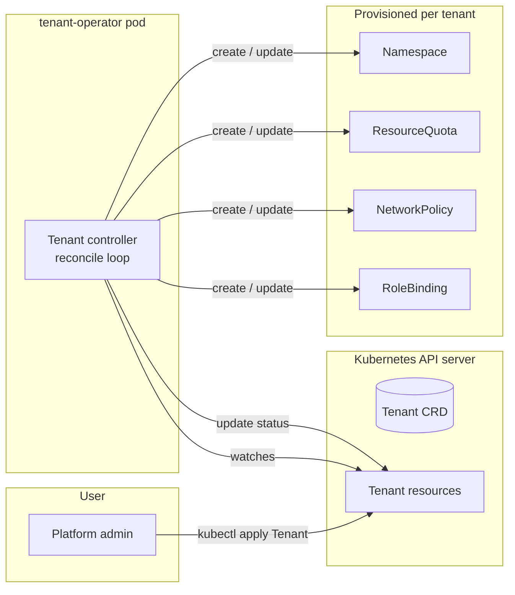
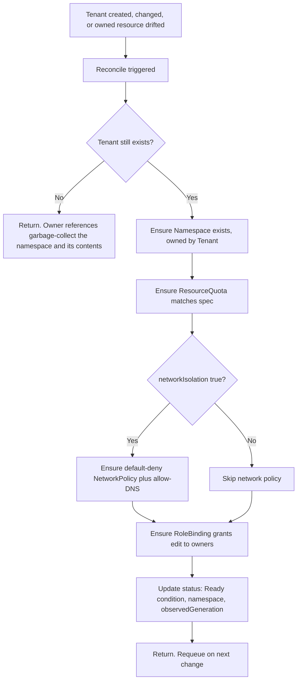

# tenant-operator

A Kubernetes operator, written in Go with [Kubebuilder](https://book.kubebuilder.io/), that turns a single declarative `Tenant` resource into a fully provisioned, isolated tenant workspace: a namespace with resource quotas, default-deny network isolation, and role-based access for the tenant's owners.

It is a compact, production-shaped example of the **Operator Pattern**: a custom resource plus a controller that continuously reconciles desired state into actual state. The problem it solves (self-service provisioning with built-in guardrails) is exactly the kind of work a cloud Control Plane Platform team does.

> Status: learning and portfolio project. Built to demonstrate the operator pattern, custom controllers, RBAC, and network policy in Go.

---

## Table of contents
1. [What it does](#what-it-does)
2. [Why this exists](#why-this-exists)
3. [Architecture](#architecture)
4. [The Tenant API](#the-tenant-api)
5. [Prerequisites](#prerequisites)
6. [Getting started](#getting-started)
7. [Project structure](#project-structure)
8. [Key code](#key-code)
9. [Testing](#testing)
10. [Roadmap and stretch goals](#roadmap-and-stretch-goals)
11. [How this maps to a cloud platform team](#how-this-maps-to-a-cloud-platform-team)
12. [References](#references)

---

## What it does

When a platform admin applies a `Tenant` resource like this:

```yaml
apiVersion: platform.example.io/v1alpha1
kind: Tenant
metadata:
  name: team-falcon
spec:
  displayName: "Team Falcon"
  owners:
    - "user:alice@example.io"
    - "group:team-falcon"
  resourceQuota:
    cpu: "8"
    memory: "16Gi"
    pods: 40
  networkIsolation: true
```

the operator continuously ensures that the following exist and stay correct:

* A **Namespace** (`team-falcon`), labelled and owned by the Tenant.
* A **ResourceQuota** in that namespace, enforcing the requested cpu, memory, and pod limits.
* A default-deny **NetworkPolicy** (plus an allow-DNS rule) when `networkIsolation` is `true`, so the tenant is isolated by default.
* A **RoleBinding** that grants the listed `owners` the built-in `edit` role inside their namespace, and nothing outside it.
* A **status** on the Tenant reporting readiness, the namespace name, and the observed generation.

Delete the `Tenant` and everything above is garbage-collected automatically through owner references.

The whole point: a developer team is onboarded with one `kubectl apply`, and the platform's rules (quotas, isolation, access) are applied the same way every time, with no manual steps and no drift.

---

## Why this exists

This project demonstrates, in a small but realistic way, the core ideas behind every Kubernetes operator and behind platforms like STACKIT's Gardener-based control plane:

* **Declarative provisioning:** users state what they want; the system makes it so.
* **The reconcile loop:** observe actual state, compare to desired state, close the gap, repeat. It is level-triggered, so it self-heals if someone changes the managed resources by hand.
* **Guardrails as code:** quotas, network isolation, and access control are encoded, not documented and hoped for.
* **Idempotency and ownership:** reconciling many times is safe, and cleanup is automatic.

---

## Architecture

### High-level view



The operator is itself just a Deployment running in the cluster. It registers the `Tenant` Custom Resource Definition, then watches for `Tenant` objects and the resources it owns, reconciling on every relevant change.

### The reconcile loop

The heart of the operator is the `Reconcile` function. It runs whenever a `Tenant` changes, whenever one of the resources it owns changes, and periodically as a safety net.



Two properties make this robust:

* **Idempotent:** every step uses create-or-update, so running it once or a hundred times converges to the same result.
* **Level-triggered:** the controller re-derives the full desired state each time rather than reacting to individual events, so if someone deletes the ResourceQuota by hand, the next reconcile recreates it.

### Components

| Component | Role |
|---|---|
| `Tenant` CRD | Extends the Kubernetes API with a new `Tenant` kind. Cluster-scoped, because it creates cluster-scoped namespaces. |
| Tenant controller | Watches `Tenant` resources and reconciles the managed resources. The business logic. |
| Manager (controller-runtime) | Hosts the controller, wires up the client, cache, scheme, leader election, and metrics. |
| Owner references | Link each managed resource back to its `Tenant`, so deletion cascades automatically. |
| Status conditions | Report `Ready` state back to users and tools in the standard Kubernetes condition format. |

---

## The Tenant API

**Group / Version / Kind:** `platform.example.io` / `v1alpha1` / `Tenant`
**Scope:** Cluster

### Spec

| Field | Type | Default | Description |
|---|---|---|---|
| `displayName` | string | "" | Human-friendly name for the tenant. |
| `owners` | list of string | required, min 1 | Users or groups granted `edit` in the tenant namespace. Use `user:` or `group:` prefixes. |
| `resourceQuota.cpu` | string | "4" | Total CPU limit for the namespace. |
| `resourceQuota.memory` | string | "8Gi" | Total memory limit for the namespace. |
| `resourceQuota.pods` | integer | 20 | Maximum number of pods in the namespace. |
| `networkIsolation` | boolean | true | When true, applies a default-deny NetworkPolicy plus an allow-DNS rule. |

### Status

| Field | Type | Description |
|---|---|---|
| `namespace` | string | The namespace provisioned for this tenant. |
| `observedGeneration` | integer | The spec generation the controller last acted on. |
| `conditions` | list of Condition | Standard conditions. `Ready=True` once all resources are provisioned. |

---

## Prerequisites

* **Go** 1.22 or newer: https://go.dev/dl/
* **Docker** (to build the operator image): https://docs.docker.com/get-docker/
* **kubectl**: https://kubernetes.io/docs/tasks/tools/
* A local cluster, either **kind** (recommended) or **minikube**:
  * kind: https://kind.sigs.k8s.io/docs/user/quick-start/
  * minikube: https://minikube.sigs.k8s.io/docs/start/
* **Kubebuilder** CLI (only needed if you scaffold from scratch): https://book.kubebuilder.io/quick-start.html

Create a local cluster:

```bash
kind create cluster --name tenant-operator
```

---

## Getting started

You can either scaffold the project from scratch (recommended for learning) or, if the code already exists, clone and run it.

### Option A: scaffold it yourself (the learning path)

```bash
mkdir tenant-operator && cd tenant-operator

# Initialize the project. Replace the repo with your own module path.
kubebuilder init --domain example.io --repo github.com/<your-user>/tenant-operator

# Create the Tenant API and controller scaffolding.
kubebuilder create api --group platform --version v1alpha1 --kind Tenant
# Answer "y" to create the resource and "y" to create the controller.
```

This generates the layout in [Project structure](#project-structure). You then fill in `api/v1alpha1/tenant_types.go` and `internal/controller/tenant_controller.go` (see [Key code](#key-code)), and regenerate manifests:

```bash
make manifests   # regenerate CRDs and RBAC from your Go markers
make generate    # regenerate deepcopy code
```

### Option B: run an existing checkout

```bash
git clone https://github.com/<your-user>/tenant-operator.git
cd tenant-operator
```

### Install the CRD and run the operator

```bash
# Install the Tenant CRD into the cluster.
make install

# Run the operator locally against your current kubecontext.
# It runs on your machine but talks to the cluster, which is the fastest dev loop.
make run
```

In a second terminal, create a tenant and watch it work:

```bash
kubectl apply -f config/samples/platform_v1alpha1_tenant.yaml

kubectl get tenants
# NAME          NAMESPACE     READY
# team-falcon   team-falcon   True

kubectl get ns team-falcon
kubectl get resourcequota -n team-falcon
kubectl get networkpolicy -n team-falcon
kubectl get rolebinding -n team-falcon
```

Test self-healing (the level-triggered property):

```bash
kubectl delete resourcequota -n team-falcon --all
# Within a moment the controller recreates it.
kubectl get resourcequota -n team-falcon
```

Test cleanup:

```bash
kubectl delete tenant team-falcon
kubectl get ns team-falcon   # gone, garbage-collected via owner reference
```

### Deploy the operator into the cluster (instead of running locally)

```bash
make docker-build docker-push IMG=<your-registry>/tenant-operator:v0.1.0
make deploy IMG=<your-registry>/tenant-operator:v0.1.0
```

### Tear down

```bash
make undeploy      # if deployed in-cluster
make uninstall     # remove the CRD
kind delete cluster --name tenant-operator
```

---

## Project structure

Standard Kubebuilder v4 layout:

```
tenant-operator/
├── api/
│   └── v1alpha1/
│       ├── tenant_types.go          # Tenant spec and status (you edit this)
│       ├── groupversion_info.go     # group/version registration
│       └── zz_generated.deepcopy.go # generated
├── cmd/
│   └── main.go                      # operator entrypoint, sets up the manager
├── config/
│   ├── crd/                         # generated CRD manifests
│   ├── default/                     # kustomize base for deployment
│   ├── manager/                     # operator Deployment
│   ├── rbac/                        # generated RBAC for the operator
│   └── samples/
│       └── platform_v1alpha1_tenant.yaml
├── internal/
│   └── controller/
│       ├── tenant_controller.go     # the reconcile logic (you edit this)
│       └── tenant_controller_test.go
├── Dockerfile
├── Makefile                         # install, run, test, build, deploy targets
├── go.mod
└── README.md
```

---

## Key code

These are illustrative starting points, not the full implementation. Imports are omitted for brevity. They show the shape of the two files you spend most of your time in.

### `api/v1alpha1/tenant_types.go`

```go
// +kubebuilder:object:root=true
// +kubebuilder:subresource:status
// +kubebuilder:resource:scope=Cluster
// +kubebuilder:printcolumn:name="Namespace",type=string,JSONPath=`.status.namespace`
// +kubebuilder:printcolumn:name="Ready",type=string,JSONPath=`.status.conditions[?(@.type=="Ready")].status`
type Tenant struct {
    metav1.TypeMeta   `json:",inline"`
    metav1.ObjectMeta `json:"metadata,omitempty"`
    Spec   TenantSpec   `json:"spec,omitempty"`
    Status TenantStatus `json:"status,omitempty"`
}

type TenantSpec struct {
    DisplayName string `json:"displayName,omitempty"`

    // +kubebuilder:validation:MinItems=1
    Owners []string `json:"owners"`

    ResourceQuota TenantResourceQuota `json:"resourceQuota,omitempty"`

    // +kubebuilder:default=true
    NetworkIsolation bool `json:"networkIsolation,omitempty"`
}

type TenantResourceQuota struct {
    // +kubebuilder:default="4"
    CPU string `json:"cpu,omitempty"`
    // +kubebuilder:default="8Gi"
    Memory string `json:"memory,omitempty"`
    // +kubebuilder:default=20
    Pods int32 `json:"pods,omitempty"`
}

type TenantStatus struct {
    Namespace          string             `json:"namespace,omitempty"`
    ObservedGeneration int64              `json:"observedGeneration,omitempty"`
    Conditions         []metav1.Condition `json:"conditions,omitempty"`
}
```

### `internal/controller/tenant_controller.go`

RBAC markers tell Kubebuilder what permissions the operator needs. `make manifests` turns them into a ClusterRole.

```go
// +kubebuilder:rbac:groups=platform.example.io,resources=tenants,verbs=get;list;watch;create;update;patch;delete
// +kubebuilder:rbac:groups=platform.example.io,resources=tenants/status,verbs=get;update;patch
// +kubebuilder:rbac:groups="",resources=namespaces,verbs=get;list;watch;create;update;patch;delete
// +kubebuilder:rbac:groups="",resources=resourcequotas,verbs=get;list;watch;create;update;patch;delete
// +kubebuilder:rbac:groups=networking.k8s.io,resources=networkpolicies,verbs=get;list;watch;create;update;patch;delete
// +kubebuilder:rbac:groups=rbac.authorization.k8s.io,resources=rolebindings,verbs=get;list;watch;create;update;patch;delete

func (r *TenantReconciler) Reconcile(ctx context.Context, req ctrl.Request) (ctrl.Result, error) {
    log := logf.FromContext(ctx)

    var tenant platformv1alpha1.Tenant
    if err := r.Get(ctx, req.NamespacedName, &tenant); err != nil {
        // Not found means it was deleted. Owner references clean up the rest.
        return ctrl.Result{}, client.IgnoreNotFound(err)
    }

    nsName := tenant.Name

    // 1. Namespace, owned by the Tenant so deletion cascades.
    ns := &corev1.Namespace{ObjectMeta: metav1.ObjectMeta{Name: nsName}}
    if _, err := controllerutil.CreateOrUpdate(ctx, r.Client, ns, func() error {
        ns.Labels = map[string]string{"platform.example.io/tenant": tenant.Name}
        return controllerutil.SetControllerReference(&tenant, ns, r.Scheme)
    }); err != nil {
        return ctrl.Result{}, err
    }

    // 2. ResourceQuota   -> CreateOrUpdate in nsName from tenant.Spec.ResourceQuota
    // 3. NetworkPolicy   -> if tenant.Spec.NetworkIsolation, apply default-deny + allow-DNS
    // 4. RoleBinding     -> bind the "edit" ClusterRole to tenant.Spec.Owners in nsName

    // 5. Status
    meta.SetStatusCondition(&tenant.Status.Conditions, metav1.Condition{
        Type:    "Ready",
        Status:  metav1.ConditionTrue,
        Reason:  "Provisioned",
        Message: "Tenant namespace and policies are in place",
    })
    tenant.Status.Namespace = nsName
    tenant.Status.ObservedGeneration = tenant.Generation
    if err := r.Status().Update(ctx, &tenant); err != nil {
        return ctrl.Result{}, err
    }

    log.Info("reconciled tenant", "tenant", tenant.Name)
    return ctrl.Result{}, nil
}

func (r *TenantReconciler) SetupWithManager(mgr ctrl.Manager) error {
    return ctrl.NewControllerManagedBy(mgr).
        For(&platformv1alpha1.Tenant{}).
        Owns(&corev1.Namespace{}).
        Complete(r)
}
```

`Owns(&corev1.Namespace{})` is what makes the controller re-reconcile when a managed namespace changes, giving you the self-healing behavior.

---

## Testing

Kubebuilder sets up `envtest`, which runs a real API server and etcd locally so you can test the controller without a full cluster.

```bash
make test            # unit and integration tests against envtest
```

A good first test asserts that creating a `Tenant` results in a namespace with the right labels and a matching ResourceQuota, and that the `Ready` condition becomes true.

For an end-to-end smoke test, use the `kind` flow in [Getting started](#getting-started) and verify the four managed resources appear and the namespace is removed on delete.

---

## Roadmap and stretch goals

Each of these is a natural next step and a good talking point:

* **Finalizers** for explicit cleanup logic beyond owner-reference garbage collection (for example, deprovisioning an external resource).
* **Admission webhooks** for validation (reject a Tenant with no owners) and defaulting, using the controller-runtime webhook support.
* **Per-owner roles** so the spec can grant `view` to some and `edit` to others.
* **LimitRange** alongside the ResourceQuota for sensible per-pod defaults.
* **Prometheus metrics** on reconcile counts and errors (the manager already exposes a metrics endpoint).
* **Conversion webhook** and a `v1beta1` to practice API versioning.
* **Package with Helm** and deploy via **Flux** to demonstrate GitOps end to end.

---

## How this maps to a cloud platform team

This project is deliberately shaped like the work a cloud Control Plane Platform team does. The vocabulary transfers directly:

* A managed Kubernetes product such as STACKIT Kubernetes Engine is built on [Gardener](https://gardener.cloud/), which is a large set of operators. Gardener watches custom resources like `Shoot` and reconciles them into real clusters, exactly the pattern here, but at much larger scale.
* This operator's `Tenant` is to a namespace what Gardener's `Shoot` is to a whole cluster: a high-level declarative request that a controller turns into many lower-level resources.
* "Automate the provisioning of infrastructure" and "support development teams deploying services on the platform" are the literal jobs this operator does for namespaces.
* The guardrails (ResourceQuota, default-deny NetworkPolicy, scoped RBAC) are the same security-and-compliance concerns a sovereign cloud cares about.

Talking points you can rehearse from having built this:

* The difference between desired and actual state, and why reconcile must be idempotent and level-triggered.
* Why owner references give clean, automatic teardown, and when you would add a finalizer instead.
* How a CRD plus a controller extends the Kubernetes API, and how that differs from a Helm chart (ongoing day-2 logic versus install-time templating).
* How RBAC and NetworkPolicy enforce multi-tenant isolation by default.

---

## References

* Kubebuilder Book: https://book.kubebuilder.io/
* Operator pattern (Kubernetes docs): https://kubernetes.io/docs/concepts/extend-kubernetes/operator/
* controller-runtime: https://pkg.go.dev/sigs.k8s.io/controller-runtime
* Kubernetes RBAC: https://kubernetes.io/docs/reference/access-authn-authz/rbac/
* Network policies: https://kubernetes.io/docs/concepts/services-networking/network-policies/
* Gardener architecture: https://gardener.cloud/docs/getting-started/architecture/
* A Tour of Go: https://go.dev/tour/

---

## License

Add a license of your choice (MIT is a common pick for portfolio projects).
